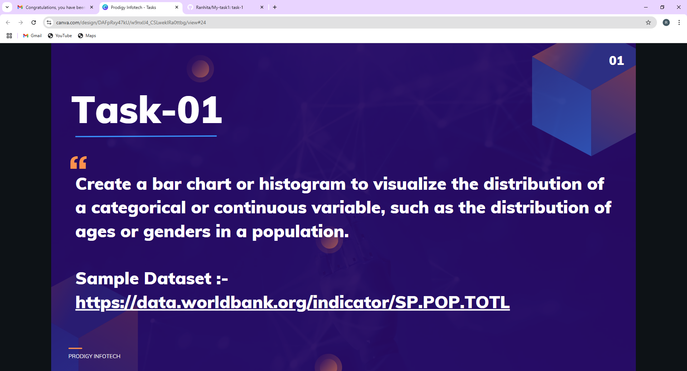

# Prodigy InfoTech Data Science Internship
## Task-1

In this task, I created a bar chart using World Bank population data to visualize the distribution of continuous or categorical variables. I used Python (Pandas, Matplotlib, Seaborn) to clean, analyze, and visualize the data. This helped me strengthen my skills in data visualization, data handling, and chart interpretation.

### Dataset
this dataset is from: (https://github.com/Ranjith-ran14/Task-1-Data-Visualization/blob/main/worldpopulationdata%20(1).csv)
### TOOLS USED
1.Jupyter Notebook 2.Microsoft Excel 3.Numpy 4.Pandas 5.Matplotlib and seaborn for Data Visualization

### Exploratoy Data Analysis(EDA)
1. Data Cleaning
2. Visualization
### Contact
For enquiries or feedback,please contact:

Via LinkedIn: Ranjith C Via Gmail: ranjith.chitrambalam@gmail.com
Thank You!
